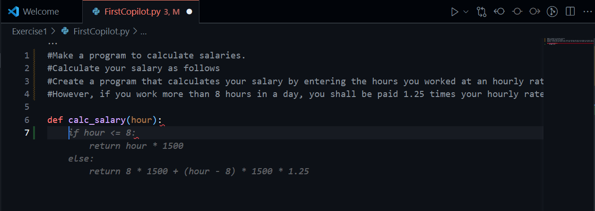
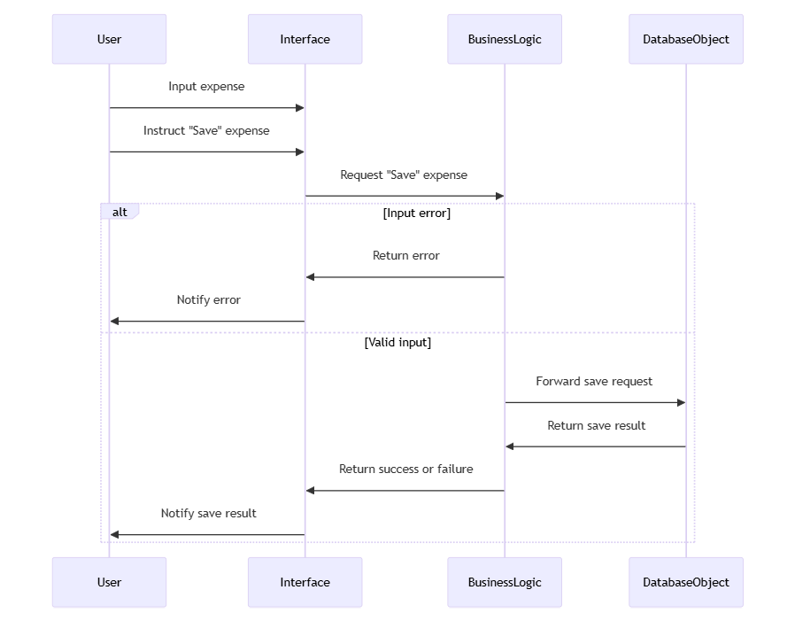
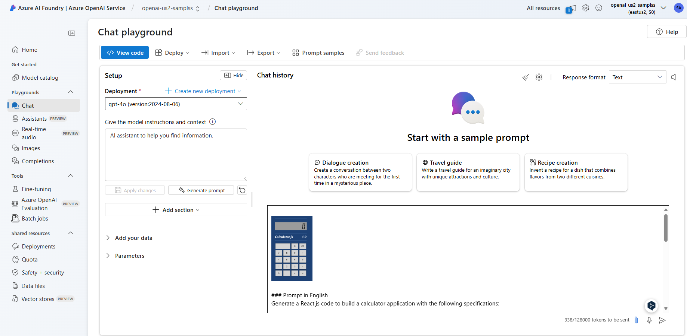

# GitHub Copilot Workshop (Practice Part) 

This workshop is intended for people who are just getting started with GitHub Copilot. Since this workshop focuses on GitHub Copilot, you may not necessarily get the same results as shown in this guide, but it's a good first step in understanding how to use GitHub Copilot and what it can do.

## Advance Preparation

- GitHub Account
- License to use GitHub Copilot Business
- Visual Studio Code
- Git client (e.g., Git for Windows if you're on Windows)
- Node.js version 20 or later
- Python 3.9 or later
- (Or any other language development environment of your choice)

## Environment Setup

This workshop will be conducted using Visual Studio Code (VSCode), which requires the installation of the GitHub Copilot extension. Please refer to the link [here](https://code.visualstudio.com/docs/copilot/setup).

---

# Exercise 1
## Advance Preparation

### Download Workshop Repository
First, download the source code for the workshop from the [Workshop Repository](https://github.com/marumaru1019/ghcbws-Global).
There are two ways to download the source code. The recommended method is to use the Git command, but you can also download a Zip file. Please follow either of the steps below.

<details>
<summary>Option 1: Using Git Commands</summary>

1. Copy the repository URL from the GitHub page.

2. Open VS Code with the GitHub Copilot extension installed, select "SOURCE CONTROL" from the left icon, and click "Clone Repository".
3. Enter the URL you copied in step 1 in the text box that appears and clone the source code.
4. In the window to select the repository location, specify the directory where you would like to save the source code.
5. After the clone is complete, click "Open" when the window to select whether or not to open the repository appears.

</details>

<details>
<summary>Option 2: Download Zip File</summary>
Select "Download ZIP" from the GitHub page to download the source code to your local environment. Then extract the ZIP file to any directory.


Open VS Code with the GitHub Copilot extension installed and open the folder you just extracted in VS Code.
</details>

In either case, it's fine if you open the necessary source code as shown below.


## Let's Try GitHub Copilot

### Experience Source Code Generation

1. First, in VS Code's Explorer, open the "Exercise1" directory and double-click "FirstCopilot.py".
2. When the contents of the source code are displayed on the right side of the screen, place the cursor at the end of line 6 and press the `Enter` key.
3. If you see a light gray suggestion from GitHub Copilot, press the `Tab` key to accept the suggestion from GitHub Copilot.

<div class="info" data-title="Note">

> If GitHub Copilot's suggestions do not appear, check the status of the Copilot icon at the bottom right of the VS Code window. If it says "Status: Ready", please wait a moment until the suggestions appear.

</div>

<details>
<summary>Example of a Suggestion</summary>


</details>

<div class="task" data-title="Additional Task">

> This program does not consider deductions, but think about how you can ask for a salary calculation program that considers a flat income tax of 20%.

</div>

### Complete and Run the Program

1. Let's continue implementing the rest of the `calc_salary` function using GitHub Copilot.
2. This time, try to implement the program so that it takes the daily working hours as an integer from standard input and outputs the salary to standard output.

<div class="tip" data-title="Tip">

> If you do not get the expected suggestions from GitHub Copilot, try redoing it several times, write what you want to do in comments, or write the initial part of the implementation (such as variable declarations).

</div>

<div class="info" data-title="Note">

> GitHub Copilot's suggestions may sometimes be the same or different. This is because GitHub Copilot uses generative AI (OpenAI's model) behind the scenes.

</div>

<details>
<summary>Example of Implementation</summary>


</details>

3. Once the implementation is complete, save the file with `Ctrl + S`, and open the terminal in VS Code with `Ctrl + Shift + @`.
4. In the terminal, type `cd Exercise1` to move to the directory.
5. In the terminal, type `python3 FirstCopilot.py` to run the implemented program.

<div class="info" data-title="Note">

> If the program fails to run, try asking GitHub Copilot what might be wrong and resolve the issue.

</div>

## Let's Try GitHub Copilot Chat
Close the Python program you implemented earlier, and open `TryCopilotChat.java` in the same directory.

1. From the icons on the left side of VS Code, select GitHub Copilot Chat to open the chat window.


2. In the chat window, try typing `@workspace /explain`. GitHub Copilot will explain its features.

3. If you want the response to appear in a language other than English, type `@workspace /explain in native language` to see the response in your native language.


<div class="info" data-title="Tip">

> You can also change the default language to your native language in the GitHub Copilot settings. For example, if you want to use Japanese, use `Ctrl + ,` to open the configuration screen, and change the Locale Override setting to `ja` in the Copilot Chat section.


</div>

<div class="task" data-title="Additional Task">

> Explore how changing the Locale Override to Japanese affects the behavior of Copilot Chat.

</div>

4. Click the `+` button at the top of the GitHub Copilot Chat window to open a new chat.
5. In the new chat, try entering "Please tell me the problems with this code."
6. Check the issues suggested by GitHub Copilot, and think about how to address them.
7. Click the `+` button at the top of the GitHub Copilot Chat window to open a new chat.
8. To see what suggestions are made when asking about specific parts of the code rather than the entire code, select the entire `main` method with your mouse, right-click, and select "Copilot" > "Add Selection to Chat".

9. The chat text window will display `TryCopilotChat.java:5-16` at the top, so enter "Please give me ideas for refactoring this code" as is. Check the refactoring ideas suggested by GitHub Copilot and consider how to address them.
10. Let's try other phrases as well. Try entering "Please tell me the vulnerabilities in this code" and see what suggestions come up. (Probably, it will point out that input validation is insufficient.)
11. Based on the suggestions received from GitHub Copilot Chat so far, try modifying the code.

<div class="tip" data-title="Tip">

> You can directly apply the suggestions from GitHub Copilot Chat to the editor. By clicking "Apply in Editor" or "Insert at Cursor" at the top of the code block, you can reflect the suggestions directly into your code. It can be risky to trust all the code suggested by GitHub Copilot Chat, but it's convenient to accept the suggestions roughly first and then make modifications afterward.

</div>

12. Once the modifications are complete, ask GitHub Copilot Chat "Please add comments to each line of this code." GitHub Copilot should suggest adding comments to each line.

<div class="info" data-title="Note">

> This time, we used the GitHub Copilot Chat window for clarity, but GitHub Copilot Chat can also be used directly in the editor with `Ctrl + I`. Additionally, you can easily invoke frequently used features by right-clicking in the editor and selecting the Copilot-related menu options.

</div>

<div class="task" data-title="Additional Task">

> Use GitHub Copilot Chat to get ideas for test code.

</div>

<div class="task" data-title="Additional Task">

> Also, try using GitHub Copilot Chat with the FirstCopilot.py program to explore vulnerability fixes, refactoring ideas, adding comments, and so on.

</div>

---

# Exercise 2

※ This Exercise 2 uses content from the repository provided by [GitHub](https://github.com/se-copilot-workshops/copilot-node-calculator).

## Using GitHub Copilot in a Simple Application

From here, we will use GitHub Copilot with a somewhat complex web application.

### First, Let's Run the Application

1. Open the terminal in VS Code and navigate to the Exercise2 directory.
2. Enter `npm install` to install the necessary packages.

<div class="info" data-title="Note">

> Do not run `npm install` in the top-level directory of this repository. Make sure you have moved to the Exercise2 directory before executing.

</div>

3. Enter `npm start` to start the application.
4. Access `http://localhost:3000` in your browser and confirm that the application is running properly.


5. After verifying the application's operation, return to VS Code and stop the application with `Ctrl + C`.

### Using GitHub Copilot to Add Features to the Application

From here, we will add some features to the existing application.

1. First, open `public/index.html` in the editor.
2. Scroll down to line 43 in the file where there is a comment `<!-- TODO: Buttons -->`.
3. Place the cursor below the comment line, press the `Enter` key to add a new line, and add the comment `<!-- add a button for a power (or exponential) function -->`.
4. Then, try adding a button that performs exponential calculations on the next line. GitHub Copilot will probably suggest code.

<div class="info" data-title="Note">

> If GitHub Copilot does not provide suggestions, try redoing it several times, write what you want to do in comments, or write the initial part of the implementation (such as variable declarations).

</div>

<div class="tip" data-title="Tip">

> GitHub Copilot Chat can be used not only in the sidebar but also inline. If you don't get suggestions from GitHub Copilot, try launching inline chat with `Ctrl + I` and inputting what you want to do into the chat.


</div>

<details>
<summary>Example of a Suggestion</summary>


</details>

5. Next, open `api/controller.js`.
6. In the processing under the comment `// TODO: Add operator` at line 13 in the file, add a new line below the line at line 18 where the processing for `'divide'` is written.
7. Try adding the processing to perform exponential calculations. GitHub Copilot will probably suggest code.

<details>
<summary>Example of a Suggestion</summary>


</details>

8. Next, open `public/client.js`.
9. In the processing under the comment `// TODO: Add operator` in the file, add a new line below the `break;` at line 35.
10. Try adding the processing to perform exponential calculations. GitHub Copilot will probably suggest code.

<details>
<summary>Example of a Suggestion</summary>


</details>

11. After saving all changes, restart the application and confirm that the added feature works correctly.

<div class="task" data-title="Additional Task">

> Try adding calculations other than exponentials (e.g., square root calculation).

</div>

### Let's Try Creating Unit Tests

1. Open the terminal, enter the command `npm test`, and execute it. The unit tests will run, and the results should be displayed in the terminal.

2. Open the `/test/arithmetic.test.js` file.
3. Scroll to around line 96 where there is a comment saying `TODO: Challenge #1`.
4. Add the comment `// add tests for subtraction` on the line below the comment `TODO: Challenge #1`.
5. You should get code suggestions from GitHub Copilot, so use them effectively to create the unit test code.

<details>
<summary>Example of a Suggestion</summary>


This only covers one case, so try adding several patterns.

</details>

<div class="tip" data-title="Tip">

> GitHub Copilot Chat can be used not only in the sidebar but also inline. If you don't get suggestions from GitHub Copilot, try launching inline chat with `Ctrl + I` and input what you want to do into the chat.


</div>

6. Once you have completed the creation, enter the command `npm test` in the terminal and execute it. The unit tests will run, and the results should be displayed in the terminal.

7. Next, create the code to test exponential calculations using GitHub Copilot.

<details>
<summary>Example of a Suggestion</summary>


</details>

8. Once you have completed the creation, enter the command `npm test` in the terminal and execute it. The unit tests will run, and the results should be displayed in the terminal.

<div class="task" data-title="Additional Task">

> If you added calculations other than exponentials in the previous steps, try creating tests for those functions using GitHub Copilot as well.

</div>

---

# Exercise 3

From here, these are optional tasks. We will handle methods of utilizing AI in development work by using Azure OpenAI Service in addition to GitHub Copilot.

## Additional Requirements

- A solution where you can include images in messages and get AI responses about the content of those images
- (Example: A web service like AI Studio where you can interact with GPT-4)

From here on, explanations will use Azure AI Studio with GPT-4 as an example, but you can proceed with an internal chat service in your own environment.

## Getting Initial Code Ideas from Images

### Let's Create Skeleton Code from a UML Diagram

1. Copy or save the image below.



2. Send the image along with the following prompt to the AI chat service. (The image below is an example using Azure AI Studio.)

`Design Java classes and methods based on this sequence diagram.`


<div class="note" data-title="Note">

> If you can adjust the maximum response of the model, set it higher to get more responses. If the AI's response is cut off midway, check this setting first.

</div>

3. Once you receive the results, examine the content carefully.

<div class="task" data-title="Additional Task">

> Based on this skeleton code, try implementing the actual Java classes and methods. Also, make use of GitHub Copilot during this process.

</div>

### Getting Initial Code Ideas from a Screen Screenshot

1. Try to see if you can create a code by passing an image of the calculator application used in Exercise 2. Copy or save the following image.


2. Send the image along with the following prompt to the AI chat service. (The image below is an example using Azure AI Studio.)

  ```
  Generate a React.js code to build a calculator application with the following specifications:

  1. **Layout**:
    - Display a calculator screen at the top.
    - The calculator background color should be blue, with buttons and the display having a gray background color.

  2. **Display**:
    - The display should show an initial value of `0`.

  3. **Buttons**:
    - Number buttons (0–9).
    - Operator buttons (+, -, ×, ÷, =).
    - Decimal point button (.).
    - A "C" button (clear all).
    - A "CE" button (clear the last entry).

  4. **Functionality**:
    - When a number button is pressed, the corresponding number is displayed on the screen.
    - Operator buttons should enable basic arithmetic operations.
    - The "=" button should calculate and display the result.
    - The "C" button should reset all inputs.
    - The "CE" button should delete the last entry.

  5. **Styling**:
    - Match the design to the attached calculator image.

  6. **React Component Design**:
    - The calculator should be built as a single parent component.
    - Buttons should be designed as reusable child components.
  ```



<div class="note" data-title="Note">

> If you can adjust the maximum response of the model, set it higher to get more responses. If the AI's response is cut off midway, check this setting first.

</div>

3. Once you receive the results, examine the content carefully.
4. Based on the screen layout, implement the React code.

<details>
<summary>Example of Creating a React App</summary>

- Open the Exercise3 directory in the terminal.
- Run `npx create-react-app my-app` in the command line. `my-app` is the directory where the app will be placed.
- After creation is complete, run `cd my-app`, and then `npm start`. A template React app should start locally.

</details>

5. Once implementation is complete, start the React application and confirm that the screen layout is displayed correctly.

<details>
<summary>Implementation Example</summary>


</details>

6. If the behavior or layout is not what you intended, please implement the code while making good use of GitHub Copilot and AI Chat. In fact, in this case, you can see that the button placement and layout are broken. It is difficult to generate a program as expected with only initial instructions, so please use Chat to give instructions many times to get closer to your ideal application.

<div class="task" data-title="Additional Task">

> Try changing the prompts you give to the AI and observe how the responses change. Also, consider what kind of prompts would provide more expected responses in this use case.

</div>

## Generate UML from Natural Language

<div class="info" data-title="Info">

> Here, we will use Mermaid notation to create UML diagrams.
> *Note: Mermaid is a JavaScript library for creating flowcharts and diagrams, using a syntax similar to Markdown.*

</div>

1. Try sending the following text to the AI chat:

```
Create a sequence diagram in Mermaid notation based on the following process description. The definitions of the lifelines are as follows:
- User who inputs into the system
- Interface that receives user input
- Business logic that processes requests from the interface
- Database object that writes to the database upon instructions from the business logic
The system is part of a sequence for a system where users apply for expenses.
The process is as follows:
The user inputs expenses into the interface.
The user instructs "Save" on the interface.
The interface requests "Save" of expenses from the business logic.
The business logic checks all expenses and returns errors to the interface if there are input errors.
If errors are returned from the business logic, the interface notifies the user of the errors.
If the expense checks in the business logic complete successfully, the business logic requests the database object to "Save" the expenses.
The database object that was requested to save the expenses saves the expenses and returns the result to the business logic.
The business logic that received the save result from the database object returns success or failure to the interface.
The interface returns the save result to the user.
```

2. If you receive text in Mermaid notation, access the Mermaid [Live Editor](https://mermaid.live/), and create a UML diagram. If there is sample text already, delete all of it before inputting the text you got from the AI.


## Explain what's in the code
1. Open the "Exercise3" directory and double-click on "bank_account.py". This code simulates a bank account and is used for managing balances in multiple currencies and calculating exchange rates.

2. Open GitHub Copilot Chat and enter `#file:bank_account.py Provide a detailed description of the code in English. Explain the function of each method and the purpose of the class as a whole.`

<div class="info" data-title="Note">

> By entering `#file:filename`, you can reference files in GitHub Copilot within VSCode. For other shortcut keys, you can check by entering `/help`.


</div>

3. Once you receive the result, verify whether the code explanation is provided at an appropriate level of detail. If further explanation is needed, ask for more details again.


<div class="tip" data-title="Tip">

> Even if the processing is already explained in comments, there may be cases where you cannot understand the content because it is in a different language from your native language. In such cases, you can launch inline chat with `Ctrl + I` and issue instructions such as `Please translate all commented out sections into native language.` This will convert only the commented-out sections into your native language all at once (the example shows conversion to English).


</div>