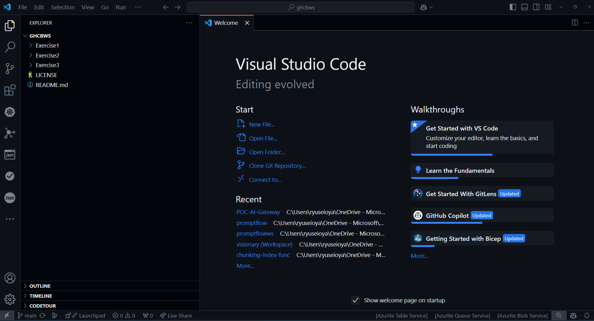
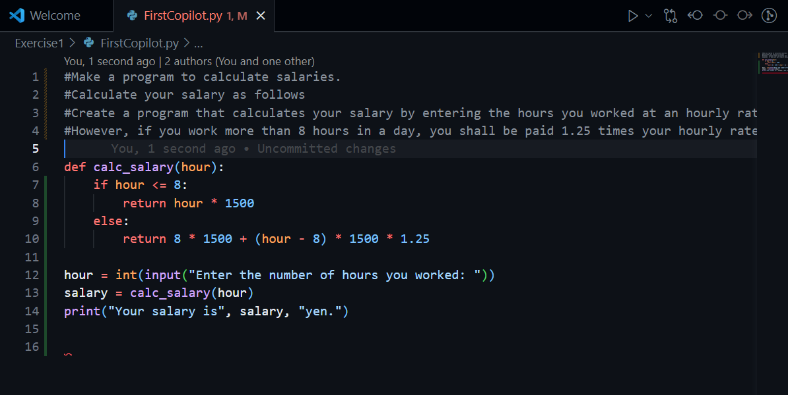
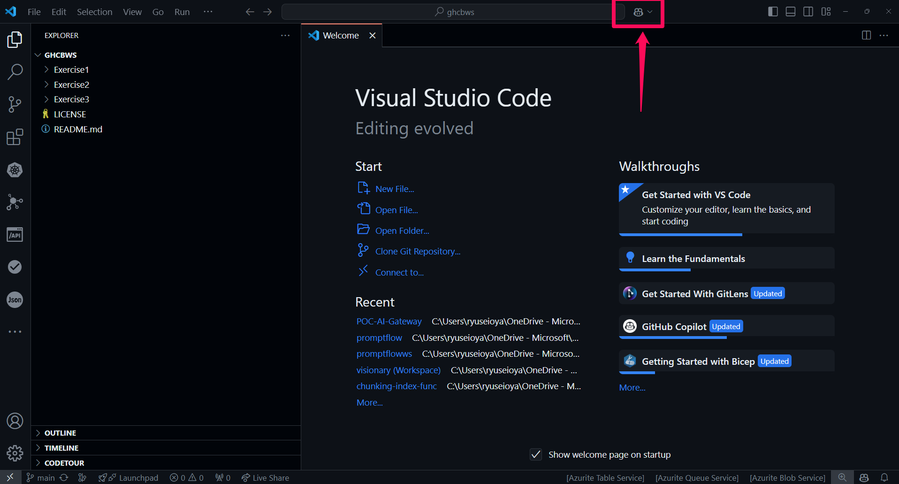
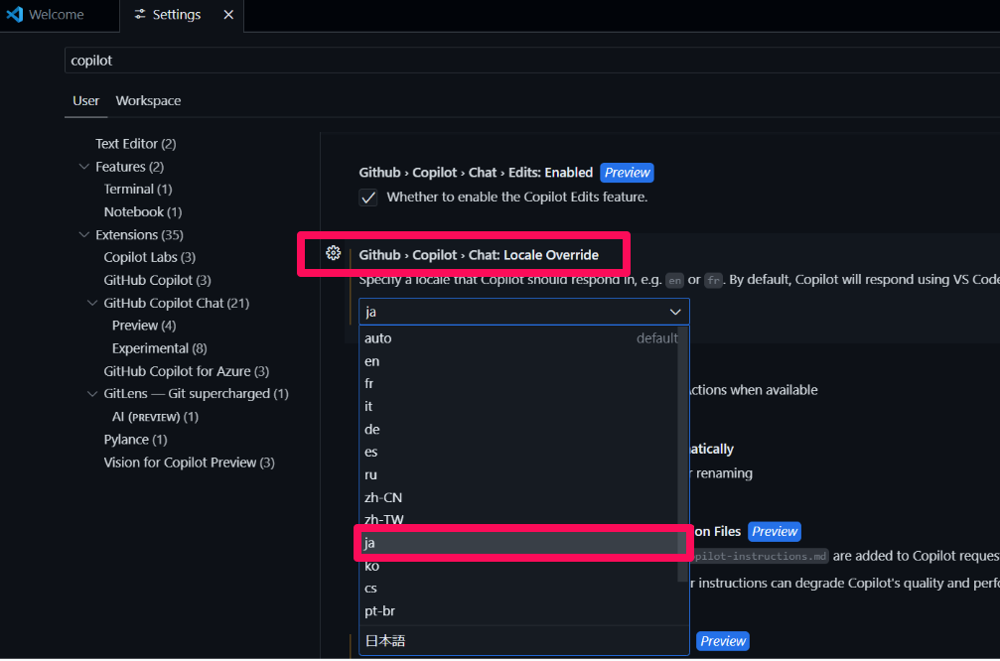

# GitHub Copilot Workshop (初級編)

GitHub Copilot をこれから使い始める/使い始めたばかりの方を対象としたワークショップです。GitHub Copilot を対象としたワークショップであるため、必ずしも本ガイドの通りの結果が返ってくるとは限りませんが、GitHub Copilot の使い方や機能について理解を深める最初の一歩を踏み出すためのワークショップとなっています。

## 事前準備

- GitHub アカウント
- GitHub Copilot Business の利用ライセンス
- Visual Studio Code
- Git クライアント（Windows 環境の場合は Git for Windows 等）
- node20 or later
- python 3.9 or later
- (そのほかお好きな言語の開発環境)

## 環境の準備

今回は Visual Studio Code（VSCode）を用いてワークショップを実施します。GitHub Copilot 拡張機能のインストールが必要になりますので、[こちら](https://code.visualstudio.com/docs/copilot/setup)のリンクを参考に拡張機能のインストールを実施してください。

---

# Exercise 1
## 事前準備

### ワークショップ用リポジトリのダウンロード
まずはこちらにある[ワークショップ用のリポジトリ](https://github.com/tenjoufire/ghcbws)からワークショップで利用するソースコード類をダウンロードしてください。
ソースコードのダウンロードには2通りの方法が利用可能です。おすすめは Git コマンドを利用する方法ですが、Zip ファイルのダウンロードも可能です。以下のどちらかの手順を実行してください。

Option1 Git コマンドの利用

1. GitHub のページからリポジトリの URL をコピーしてください。

2. GitHub Copilot の拡張機能がインストールされた VS Code を開き、左側のアイコンから「SOURCE CONTROL」を選択し、「Clone Repositry」をクリックしてください。
3. 1の手順でコピーした URL を出てきたテキストボックスに入力し、ソースコードのクローンを行ってください。
4. リポジトリの保存場所を選択するウィンドウで、ソースコード類を保存するお好きなディレクトリを指定してください。
5. クローン完了後、リポジトリを開くかどうかを選択するウィンドウが出た場合は「Open」をクリックしてください

Option2 Zip ファイルのダウンロード

GitHub のページから「Download ZIP」を選択し、ローカルの環境にソースコードをダウンロードしてください。その後、ZIPファイルを任意のディレクトリに展開してください。

GitHub Copilot の拡張機能がインストールされた VS Code を開き、先ほど展開したフォルダを VS Code で開いてください。

どちらの方法で実施した場合でも以下のように、必要なソースコード類を開けていれば OK です。

## まずは GitHub Copilot を触ってみる

### ソースコード生成を体験してみよう

1. はじめに VS Code の Explorer の中から、「Exercise1」ディレクトリを開き、「FirstCopilot.py」をダブルクリックしてください。
2. 画面右側にソースコードの中身が表示されたら、6行目の最後にカーソルを持っていき`Enter`キーを押してみてください。
3. 薄いグレーの色で GitHub Copilot からの補完が確認出来たら、`tab`キーを押して GitHub Copilot からの提案を受け入れてください。

> GitHub Copilot の補完が出ない場合は、VS Code ウィンドウの右下の Copilot アイコンの状態を確認してみてください。「Status:Ready」となっている場合は、補完が出るまで少し待ってみてください。

提案の例

> このプログラムは控除が考慮されていませんが、所得税が一律で20%かかることを考慮した給与計算のプログラムを提案してもらうにはどうすればよいか考えてみてください。

### プログラムを完成させ実行してみよう

1. 引き続き、`calc_salary`関数の続きを GitHub Copilot を使いながら実装していきましょう。
2. 今回は、標準入力から一日の労働時間を整数で入力し、標準出力で給料を出力するように実装してみてください。

> GitHub Copilot から思った通りの提案が出ない場合は、何回かやり直してみたり、やりたいことをコメントでかいてみたり、実装の最初の部分（変数宣言など）を書いてみたりしてください。

> GitHub Copilot の提案は同じものである場合もあれば異なる提案になる場合もあります。これは GitHub Copilot の裏側で生成 AI（Open AI のモデル）を利用しているためです。

実装の例

3. 実装が完了したら、`Ctrl + S`でファイルを保存し、`Ctrl + Shift + @`で VS Code 上のターミナルを開いてください。
4. ターミナル上で `cd Exercise1`と入力し、ディレクトリを移動してください。
5. ターミナル上で `python3 FirstCopilot.py` と入力し、実装したプログラムを実行してください。

> プログラムの実行に失敗した場合は、どこがおかしいのかを含めて GitHub Copilot に聞いて解決を図ってみてください。

## GitHub Copilot Chat を触ってみる
一度先ほど実装した python のプログラムは閉じ、同じディレクトリの中にある `TryCopilotChat.java` を開いてください。

ウィンドウの閉じ方

1. VS Code の左側のアイコンから GitHub Copilot Chat を選択し、チャットウィンドウを開いてください。

2. チャットウィンドウの中で、`@workspace /explain`と入力してみてください。GitHub Copilot がどのような機能を持っているかを説明してくれます。

3. もし回答が英語で表示された場合は、`@workspace /explain 日本語で` と入力してみてください。

> GitHub Copilot の設定で、日本語を既定の言語に変更することも可能です。`Ctrl + ,` で設定画面を開き、`Copilot Chat` の項目から Locale Override の項目を `ja` に変更してください。

> Locale Override を日本語に変更した場合、Copilot Chat の挙動にどのような違いがあるかを調べてみてください。

4. GitHub Copilot Chat のウインドウ上部にある `+` ボタンをクリックし、新しいチャットを開いてください。
5. 新しいチャットにて、「このコードの問題点を教えてください。」と入力してみてください。
6. GitHub Copilot が提案する問題点を確認し、それに対してどのように対処するかを考えてみてください。
7. GitHub Copilot Chat のウインドウ上部にある `+` ボタンをクリックし、新しいチャットを開いてください。
8. また、コード全体ではなく、特定の部分に対して問題点を聞いてみるとどのような提案が出るかを確認するために、`main` メソッド全体をマウスで選択してから、右クリックして「Add Selection to Chat」を選択してみてください。

9. Chat のテキストウィンドウの上部に `TryCopilotChat.java:5-16` と表示されているので、そのまま「このコードのリファクタリングのアイデアをください」と入力してください。GitHub Copilot が提案するリファクタリングのアイデアを確認し、それに対してどのように対処するかを考えてみてください。
10. 他の文言でも試してみましょう。「このコードの脆弱性を教えてください」と入力してみるとどのような提案が出るかを確認してみてください。（恐らく、入力のバリデーションが不足していることが指摘されると思います。）
11. これまでに GitHub Copilot Chat からもらった提案をもとに、コードを修正してみてください。

> GitHub Copilot Chat からもらった提案はそのまま、エディタ上に反映させることもできます。コードブロックの上部にある `Apply in Editor` や `Insert at Cursor` をクリックすることで、提案をそのままコードに反映させることができます。GitHub Copilot Chat が提案するコードをすべて信用するのは危険ですが、まずは提案をざっくり受け入れて、そのあとで修正を加えるという使い方も便利です。

12. 修正が完了したら、GitHub Copilot Chat で「このコードの各行にコメントをつけてください」と聞いてみてください。GitHub Copilot が各行にコメントをつける提案をしてくれるはずです。

> 今回はわかりやすさ重視のため、GitHub Copilot Chat のウィンドウを使っていますが、GitHub Copilot Chat は `Ctrl + I` で直接エディタ上で利用することも可能です。また、エディタ上で右クリックして、Copilot 関連のメニューを選択することで、よく利用する機能を簡単に呼び出すことも可能です。

> GitHub Copilot Chat を使って、テストコードのアイデアをもらってみてください。

> FirstCopilot.py のプログラムでも GitHub Copilot Chat を用いて、脆弱性の修正やリファクタリングのアイデア、コメントの追加などを試してみてください。

---

# Exercise 2

※この Exercise 2 は、[GitHub 社提供](https://github.com/se-copilot-workshops/copilot-node-calculator) のリポジトリの内容を利用しています。

## GitHub Copilot を簡単なアプリケーションで利用してみる

ここからは、ある程度複雑な Web アプリケーションを題材に GitHub Copilot を使ってみます。

### まずはアプリケーションを実行してみる

1. VS Code のターミナルを開き、 Exercise2 ディレクトリに移動してください。
2. `npm install` と入力し、必要なパッケージをインストールしてください。

> このリポジトリのトップディレクトリで `npm install` を実行しないでください。Exercise2 ディレクトリに移動しているのを確認してから実行してください。

3. `npm start` と入力し、アプリケーションを起動してください。
4. ブラウザで `http://localhost:3000` にアクセスし、アプリケーションが正常に動作していることを確認してください。

5. アプリケーションの動作を確認したら、VS Code に戻り、`Ctrl + C` でアプリケーションを停止してください。

### GitHub Copilot を使ってアプリケーションに機能を追加してみる

ここからは既存のアプリケーションにいくつかの機能を追加していきます。

1. まずは、`public/index.html` をエディタ上で開いてください。
2. ファイルの中にある `<!-- TODO: Buttons -->` というコメントまでスクロールしてください。
3. コメントの行の下にカーソルを持っていき、`Enter` キーを押して新しい行を追加し、`<!-- add a button for a power (or exponential) function -->` とコメントを追加してください。
4. さらに下の行にべき乗の計算を行うボタンを追加してみてください。おそらく GitHub Copilot がコードの提案をしてくれるはずです。

> GitHub Copilot の提案が出ない場合は、何回かやり直してみたり、やりたいことをコメントでかいてみたり、実装の最初の部分（変数宣言など）を書いてみたりしてください。

提案の例

5. 次に `api/controller.js` を開いてください。
6. ファイルの中にある `// TODO: Add operator` というコメントの下にある処理の中に、べき乗の計算を行う処理を追加するために、`'devide'` の処理が書かれている行の下に新しい行を追加してください。
7. べき乗の計算を行う処理を追加してみてください。おそらく GitHub Copilot がコードの提案をしてくれるはずです。

提案の例

8. 次に `public/client.js` を開いてください。
9. ファイルの中にある `// TODO: Add operator` というコメントの下にある処理の中で、35行目の `break;` の下に新しい行を追加してください。
10. べき乗の計算を行う処理を追加してみてください。おそらく GitHub Copilot がコードの提案をしてくれるはずです。

提案の例

11. 全ての変更を保存した後、アプリケーションを再度起動して、追加した機能が正常に動作することを確認してください。

> べき乗以外の計算も追加してみてください。（例：平方根の計算）

### ユニットテストの作成をやってみる

1. ターミナルを開き、`npm test` とコマンドを入力し実行してください。ユニットテストが実行されその結果がターミナル上で表示されているはずです。

2. `/test/arithmetic.test.js` ファイルを開いてください。
3. 96行目付近にある `TODO: Challenge #1` と書いているコメントまでスクロールしてください。
4. `TODO: Challenge #1` と書いているコメントの下の行に `// add tests for subtraction` というコメントを追加してください。
5. GitHub Copilot からコードの提案が得られると思いますので、それをうまく活用しながらユニットテストのコードを作成してください。
6. 作成完了しましたら、ターミナル上で `npm test` とコマンドを入力し実行してください。ユニットテストが実行されその結果がターミナル上で表示されているはずです。

7. 続いて、べき乗の計算のテストを行うコードも GitHub Copilot を使いながら作成してください。

8. 作成完了しましたら、ターミナル上で `npm test` とコマンドを入力し実行してください。ユニットテストが実行されその結果がターミナル上で表示されているはずです。

> もし、前の手順でべき乗以外の計算も追加していた場合は、その機能に関するテストも GitHub Copilot を利用して作成してみてください。

---

# Exercise 3

ここから先は、オプションの課題になります。GitHub Copilot 以外に Azure OpenAI Service を併用しながら、開発業務における AI の利活用の方法について取り扱います。

## 追加要件

- 画像をメッセージの中に入れることができ、その画像の内容について AI からの回答を得られるソリューション
- （例：GPT-4o と対話できる AI Studio のような Web サービス）

ここから先、説明は Azure AI Studio の画面で GPT-4o を例にしますが、社内独自環境のチャットサービスで進めても問題ありません。

## 画像からコードの初期アイデアをもらう

### UML 図からスケルトンコードを作ってみる

1. 下記画像をコピーもしくは保存してください。

2. 先ほどの画像を以下のプロンプトと一緒に AI チャットサービスに送信してください。（以下の画像は Azure AI Studio で利用している例です。）

`このシーケンス図から、Javaのクラスとメソッドを設計してください。`

3. 結果が返ってきましたら、